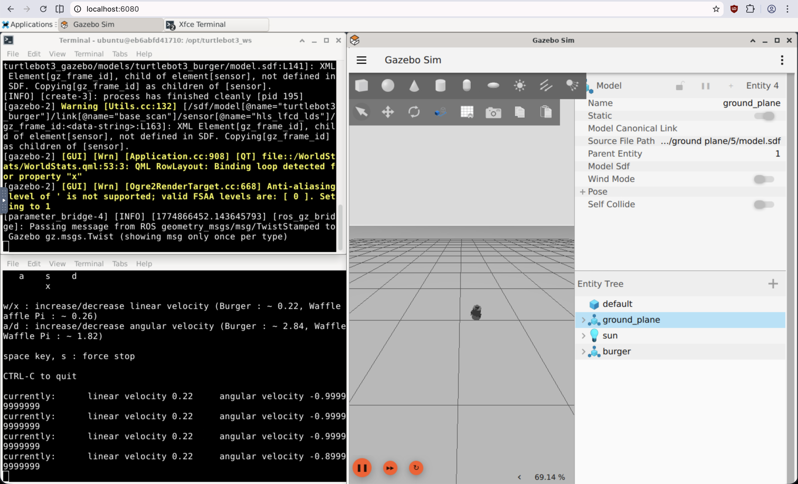

# ROS 2 + Gazebo in Docker (noVNC)

Run ROS 2 Gazebo simulations in a fully containerized environment and access them through a browser desktop (noVNC). No VM, no native ROS install — just Docker and a browser.



This repository is optimized for:

- 🐳 Docker Desktop
- 🖥️ Browser-based desktop via noVNC
- 🔀 Multi-arch images (arm64 + amd64) — native performance on any host
- ⚡ Near zero setup: copy `.env`, build or pull, and you're running in under 60 seconds

## Compatibility

This project was originally developed for macOS Apple Silicon — getting ROS 2 + Gazebo running natively on arm64 macOS can be a hassle, so this containerized setup solves that. It also bypasses the need for a virtual machine on Windows or any other platform where ROS 2 installation is complicated. It has since been tested and confirmed working on amd64 (Intel i5) Linux as well, and should work on any host with Docker.

- **Tested:** macOS Apple Silicon (arm64) + Docker Desktop, Linux/amd64 (Intel i5) + Docker.
- **Expected to work:** other operating systems with Docker, and Podman setups that support Compose (`podman compose` / `podman-compose`).
- **No emulation overhead:** multi-arch images mean the container runs natively on both arm64 and amd64 hosts.
- **Apple Silicon users:** add `platform: linux/arm64` to the service in `docker-compose.yml` if you want to pin the architecture explicitly.
- **Podman caveat:** depending on your Podman/rootless setup, you may need to remove `security_opt: seccomp=unconfined`.

## Available variants

| Variant | Ubuntu | ROS 2 | Gazebo | Docker tag |
| ------- | ------ | ----- | ------ | ---------- |
| **Jazzy** (recommended) | 24.04 | Jazzy | Gazebo Harmonic | `:latest`, `:jazzy` |
| Humble (alternative) | 22.04 | Humble | Classic Gazebo 11 | `:humble` |

**Jazzy (Ubuntu 24.04)** is the primary variant — fully tested with TurtleBot3 simulations, multi-arch CI, and everything working out of the box.

**Humble (Ubuntu 22.04)** is provided as an alternative for users who need the older LTS. It includes TurtleBot3 simulations using classic Gazebo 11 (built from source during the image build).

Both variants include the ROS-Gazebo bridge, XFCE desktop over noVNC, and configurable packages. No host ROS installation is required.

Pre-built images are available on [GitHub Container Registry](https://github.com/jb381/ros2-gazebo-novnc/pkgs/container/ros2-gazebo-novnc).

## Prerequisites

- Docker Desktop / Podman installed and running

## Quick start

1. Copy `.env.example` to `.env` and adjust as needed:

   ```bash
   cp .env.example .env
   ```

   The defaults in `.env.example` configure a TurtleBot3 setup for Jazzy. To run a bare ROS 2 + Gazebo environment instead, clear the build settings in `.env`:

   ```bash
   ADDITIONAL_PACKAGES=
   WORKSPACE_REPOS=
   ```

   See [Configuration](#configuration) for all available variables.

### 🍎 Option A: Build from source (Apple Silicon recommended)

The first build may take a while as it downloads and installs ROS 2, Gazebo, and any additional packages.

**Jazzy (default):**

```bash
docker compose build
docker compose up -d
```

**Humble:**

```bash
docker compose --profile humble build
docker compose --profile humble up -d
```

### 📦 Option B: Pre-built image (amd64 Linux / Windows recommended)

Pulling the pre-built image gets you running in under 60 seconds. Create a `docker-compose.override.yml` to use it:

**Jazzy:**

```bash
echo 'services:
  gazebo-ros2:
    image: ghcr.io/jb381/ros2-gazebo-novnc:latest
    build: {}' > docker-compose.override.yml
```

**Humble:**

```bash
echo 'services:
  gazebo-ros2-humble:
    image: ghcr.io/jb381/ros2-gazebo-novnc:humble
    build: {}' > docker-compose.override.yml
```

Then start — Docker will pull the image automatically:

```bash
# Jazzy:
docker compose up -d

# Humble:
docker compose --profile humble up -d
```

### After starting

1. Check status:

   ```bash
   docker compose ps
   ```

2. Open in browser:
   - Jazzy: `http://localhost:6080`
   - Humble: `http://localhost:6081`
   - VNC password: the value of `VNC_PASSWORD` (default: `ubuntu`)

## Configuration

All settings are configured via a `.env` file (copy from `.env.example`).

### Runtime settings (no rebuild needed)

| Variable        | Default     | Description                             |
| --------------- | ----------- | --------------------------------------- |
| `VNC_PASSWORD`  | `ubuntu`    | Password for noVNC access               |
| `VNC_GEOMETRY`  | `1920x1080` | Desktop resolution                      |
| `ROS_DOMAIN_ID` | `30`        | ROS 2 DDS domain ID                     |
| `PORT`          | `6080`      | Host port for noVNC (Jazzy)             |
| `PORT_HUMBLE`   | `6081`      | Host port for noVNC (Humble)            |

### Build settings (require `docker compose build`)

Each variant uses its own set of build variables so they don't interfere with each other:

| Variable                    | Default   | Description                                                                                                                                            |
| --------------------------- | --------- | ------------------------------------------------------------------------------------------------------------------------------------------------------ |
| `ADDITIONAL_PACKAGES`       | _(empty)_ | Extra apt packages for the **Jazzy** build                                                                                                            |
| `WORKSPACE_REPOS`           | _(empty)_ | Git repos to clone and build for **Jazzy**. Append `#branch` to specify a branch. Defaults to `ROS_DISTRO` if omitted.                                |
| `ADDITIONAL_PACKAGES_HUMBLE` | _(empty)_ | Extra apt packages for the **Humble** build                                                                                                           |
| `WORKSPACE_REPOS_HUMBLE`    | _(empty)_ | Git repos to clone and build for **Humble**. Append `#branch` to specify a branch. Defaults to `ROS_DISTRO` if omitted.                               |

> `.env.example` ships with TurtleBot3 values pre-filled for Jazzy as a ready-to-use starting point.

### Using a different robot

Edit the build settings in your `.env` file. Make sure to match the ROS distro in package names:

```bash
# Jazzy
ADDITIONAL_PACKAGES=ros-jazzy-my-robot ros-jazzy-my-robot-sim
WORKSPACE_REPOS=https://github.com/my-org/my_robot_simulations.git#main

# Humble
ADDITIONAL_PACKAGES_HUMBLE=ros-humble-my-robot ros-humble-my-robot-sim
WORKSPACE_REPOS_HUMBLE=https://github.com/my-org/my_robot_simulations.git#main
```

After changing build settings, rebuild:

```bash
docker compose build --no-cache
docker compose up -d
```

## 🐢 Run simulation (TurtleBot3 example)

Both variants ship with TurtleBot3 pre-installed. Inside the noVNC desktop, open terminal #1 and run:

```bash
export TURTLEBOT3_MODEL=burger
ros2 launch turtlebot3_gazebo empty_world.launch.py
```

Keep terminal #1 running. Open terminal #2 (also in noVNC) and run teleop:

```bash
export TURTLEBOT3_MODEL=burger
ros2 run turtlebot3_teleop teleop_keyboard
```

> **Note:** The Jazzy variant uses Gazebo Harmonic (`ros_gz` bridge). The Humble variant uses classic Gazebo 11 (`gazebo_ros_pkgs` built from source).

## Common commands

View logs:

```bash
# Jazzy:
docker compose logs --tail=200 gazebo-ros2

# Humble:
docker compose --profile humble logs --tail=200 gazebo-ros2-humble
```

Stop:

```bash
# Jazzy:
docker compose down

# Humble:
docker compose --profile humble down
```

Clean rebuild:

```bash
# Jazzy:
docker compose down && docker compose build --no-cache && docker compose up -d

# Humble:
docker compose --profile humble down && docker compose --profile humble build --no-cache && docker compose --profile humble up -d
```

## 🔧 Troubleshooting

### noVNC page shows "Failed to connect to server"

The container likely failed to start VNC/noVNC fully.

```bash
docker compose ps
docker compose logs --tail=200 gazebo-ros2
docker compose down
docker compose build --no-cache
docker compose up -d
```

For the Humble variant, replace the service name with `gazebo-ros2-humble` and add `--profile humble` to compose commands.

### Gazebo launches but teleop does nothing

Make sure teleop runs in a second terminal while the simulation is still active in terminal #1. Also verify:

```bash
export TURTLEBOT3_MODEL=burger
```

## Notes

- This setup is intentionally minimal to reduce moving parts.
- Direct VNC port exposure is disabled; use noVNC (Jazzy: `6080`, Humble: `6081`).
- The container includes a health check that verifies noVNC is responding.
- The container restarts automatically (`unless-stopped`) if it crashes.

## License

MIT License. See `LICENSE`.
